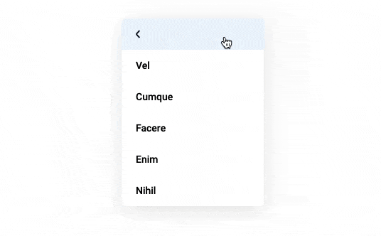

# jQuery Stack Menu

The plugin make simply navigation menu from unordered list



[VIEW DEMO](https://maximzhurkin.github.io/jquery-stack-menu/)

## Getting Started
### 1. Include [jQuery](https://jquery.com/) and stackMenu
```html
<head>
  <link href="jquery-stack-menu.min.css" rel="stylesheet">
  <script src="jquery.min.js"></script>
  <script src="jquery-stack-menu.min.js"></script>
</head>
```
### 2. Add HTML
```html
<nav id="stack-menu">
  <ul>
    <li><a href="#">Fugiat</a>
      <ul>
        <li><a href="#">Perferendis</a></li>
          <ul>
            <li><a href="#">Vel</a></li>
            <li><a href="#">Cumque</a></li>
          </ul>
        </li>
        <li><a href="#">Ipsum</a></li>
      </ul>
    </li>
  </ul>
</nav>
```
### 3. Call plugin
```javascript
$(document).ready(function() {
  $('#stack-menu').stackMenu();
});
```
## Options
```javascript
$('#stack-menu').stackMenu({
    all: false, // add links to parents
    allTitle: 'All' // parents links text
});
```
